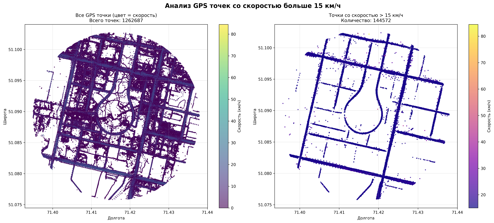

# Traffic Data Analysis



This project analyzes vehicle GPS data, groups it by trajectories, and generates a heatmap showing road congestion levels.

## 1. Extract the Archive
First, extract **Archive.zip** into the project directory.  
It should contain all the necessary data files for analysis.

## 2. Install Dependencies
Install the required Python dependencies (preferably in a virtual environment):
```bash
pip install -r requirements.txt
```

## 3. Data Analysis
Run the `group_vehicles.py` script to:

- process and group vehicle data  
- calculate trajectory statistics  
- save the results to `grouped_vehicles_data.csv`

```bash
python group_vehicles.py
```

## 4. Heatmap Visualization
Run the `heatmap_visualization.py` script to generate the heatmap and save it as `heatmap.png`.

```bash
python heatmap_visualization.py
```

After running it, you’ll get a visual representation of traffic congestion across different roads.
